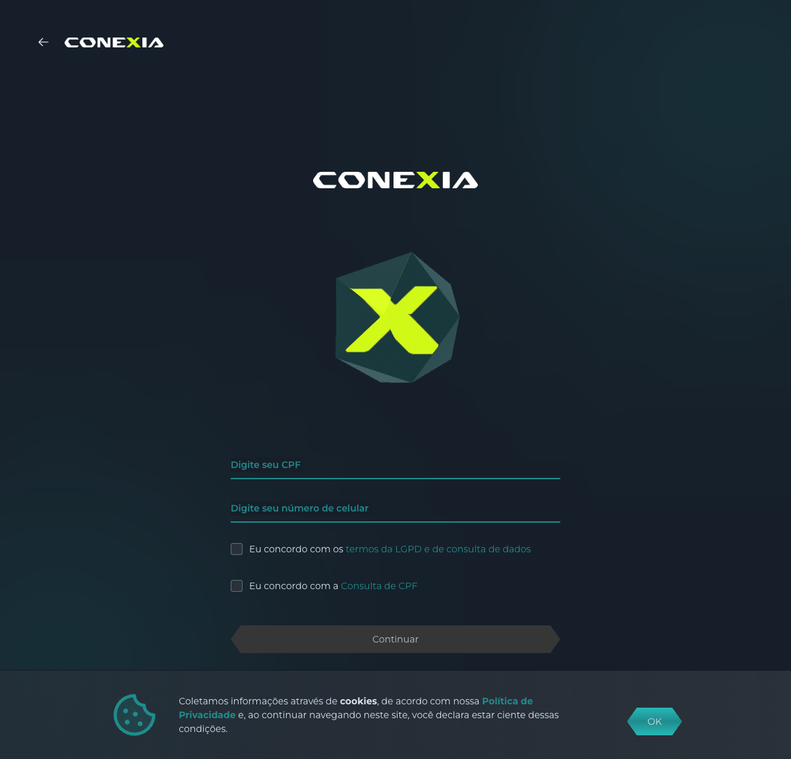
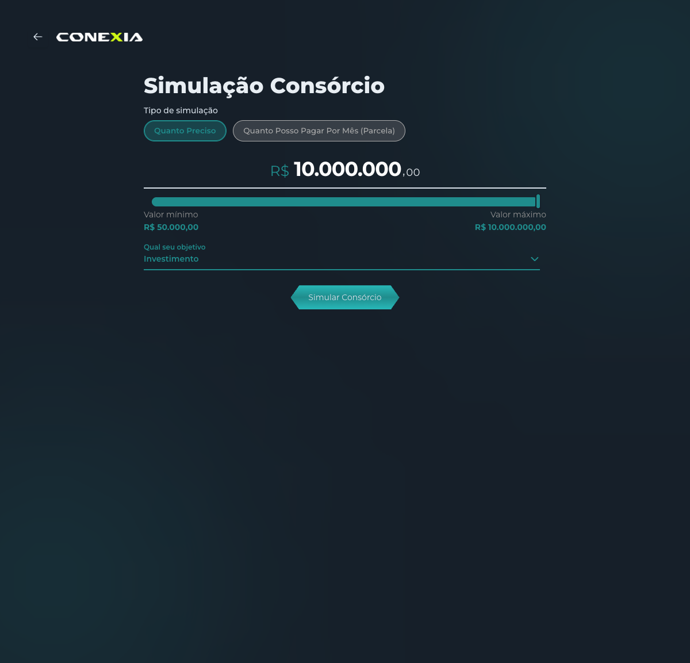
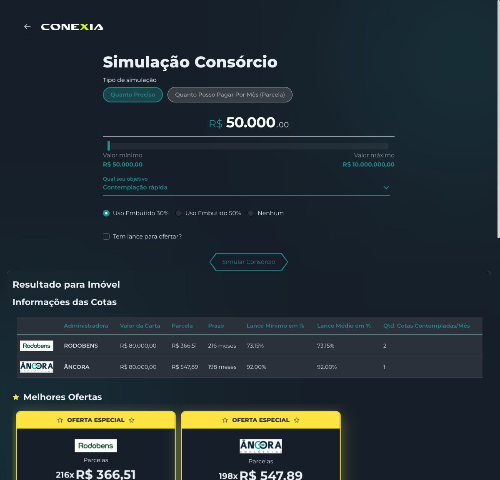

# Bevi — Fluxo do Simulador (observado ao vivo)

> Walkthrough do simulador white-label da Bevi/AGX (loja CONEXIA / LABRE Assessoria),
> navegado de ponta a ponta via Playwright em **2026-05-27**.
> URL: `https://proposta.uxvision.tech/?code=...&agx_hash=...`. Detalhes de rede → [API Discovery](./bevi-api-discovery.md).

## Visão geral

Fluxo de **auto-contratação proposta-first**, em 12 etapas, com máquina de estados servida pelo
endpoint `/system`. Identifica o usuário (CPF) **antes** de qualquer simulação, faz autofill por CPF,
seleciona segmento, simula com lance embutido, escolhe oferta e faz **KYC inline** até inserir a proposta.

```
dadosIniciais → [consultaConsorcioBevicred] → (preenchimento oculto) → oQueVocePretendeAdquirir
   → [esperaMelhorOferta] → simulation → (escolher oferta) → documentoPessoal
   → dadosDoDocumentoDeIdentidade → endereco → comprovanteDeEndereco → waitingForUniqueCode
```

## Passo a passo

### 1. Dados iniciais — CPF + LGPD de cara

CPF, celular e **dois aceites** (LGPD + Consulta de CPF). "Continuar" só habilita com tudo preenchido.
É o coração do modelo **proposta-first**: nenhum dado de consórcio antes de se identificar.
Se o CPF já tem proposta aberta → dialog "retomar ou iniciar nova" (tratamento do **409**).

### 2. Consulta + autofill (oculto)
Após "Continuar", o sistema consulta o consórcio e um bureau por CPF e **preenche nome + nascimento
automaticamente**. O usuário só digitou o CPF.

### 3. O que pretende adquirir — 6 segmentos

**Imóvel, Veículo, Motocicleta, Serviços, Pesados, Outros Bens.** (Imóvel e Moto disponíveis.)

### 4. Simulação — lance embutido é o eixo

- **Tipo:** "Quanto Preciso" (valor total) ou "Quanto Posso Pagar Por Mês" (parcela).
- **Valor:** imóvel R$ 50 mil – R$ 10 milhões.
- **Objetivo:** Investimento × **Contemplação rápida** (as duas personas, nativo).
- Ao escolher "Contemplação rápida", destravam: **Lance Embutido** (30% / 50% / Nenhum) e
  **"Tem lance para ofertar?"**.

### 5. Resultado — leque comparável de ofertas

Tabela "Informações das Cotas" + cards "Melhores Ofertas" + "Outras Ofertas". **Múltiplas
administradoras** (RODOBENS, ÂNCORA) e grupos, cada uma com carta, parcela, prazo, lance
embutido/médio/necessário e resultado. Estrutura de dados completa → [API Discovery §3](./bevi-api-discovery.md#3-shape-real-da-oferta-o-achado-central).

### 6. Escolher oferta → KYC inline (sem redirect)
Escolher a oferta grava a cota e avança direto para o KYC **dentro do app** (não redireciona):
- **Documento pessoal**, **Dados de identidade** (RG, órgão, UF, nascimento, mãe, gênero, naturalidade),
  **Endereço** (conta de luz), **Comprovante de endereço**.
- **Todos opcionais** — dá pra pular tudo. Upload de arquivo abre portal `conexia.agxsoftware.com`.

### 7. Inserção da proposta (assíncrona)
`waitingForUniqueCode`: insere na administradora em background e gera o nº da proposta
(ex.: `24164206`, status "Pendente em fluxo"). Não é instantâneo.

## Leituras de produto (pro Aja Agora)

- **Autofill por CPF** elimina digitação de nome/dados — fricção baixa mesmo sendo proposta-first.
- **Lance embutido + objetivo** são nativos e centrais na UX deles — valida nosso diferencial.
- **KYC opcional e inline** mostra que dá pra fechar sem redirect e sem travar por documento.
- **Simulação só com identidade**: o "explorar anônimo" do Aja não tem equivalente direto aqui
  (ver gaps em [aderência](./bevi-consorcio-aderencia.md)).
